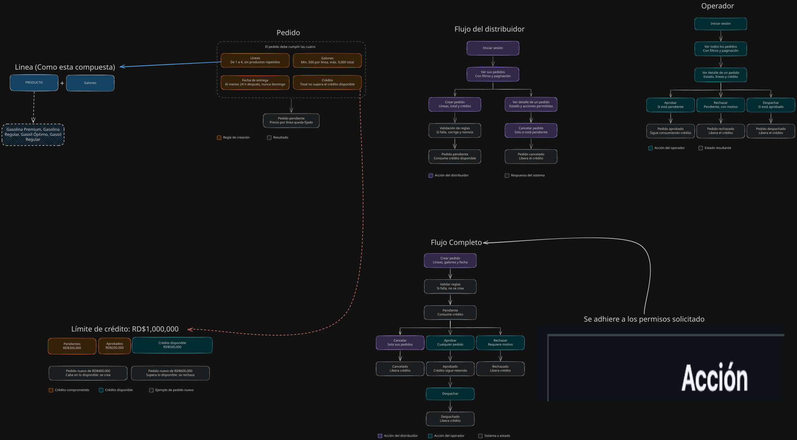

Entendimiento del flujo ver diagramas:

[Abrir en Excalidraw](https://excalidraw.com/#json=d-z1uSN3mValGtYLhV0h2,1pu9srmqkNi35VcSjiVD2g)

# Base de datos
- Postgresql: Es una de la que mejor conozco 
- typeOrm: Como ORM mejor conocido para mi 

## Sistema de módulos y framework de pruebas del backend
- CommonJS con Jest.

**Por qué:**
- Jest es el framework de pruebas con más documentación y ejemplos en NestJS, y es el que mejor domino.

## Versión de NestJS
- NestJS 11, no la 12 (última).

**Por qué:**
- NestJS 11 funciona con Node 22 sin configuración adicional, mientras que NestJS 12 con Jest sus pruebas requieren Node 24 y una opción experimental 